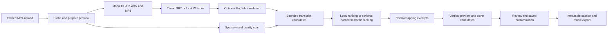

# Guided generation and account-owned workspaces

Date: 2026-10-01. Supersedes the initial review boundary; the product remains a web app.

## User workflow

1. Sign in or create an email account. Google and Facebook appear when the operator configures their registered OAuth applications.
2. Import an MP4. Choose language (or auto-detect), destination, preferred maximum duration, up to five suggestions, and optional English captions beside the upload controls.
3. Review a large original-video preview and timeline. Download the extracted MP3 or upload a timed SRT transcript in its actual language.
4. Generate shorts. Navigate immediately to a separate results page with durable job progress.
5. Select a suggestion. Watch a large vertical preview, read three evidence-based context sentences and the timed excerpt transcript.
6. Toggle subtitles, choose original/English captions when available, edit the title, select an original music bed and choose a cover.
7. Open the cover editor to change text/style, select one of up to three clear frames, capture another video frame or upload an image. Download the styled JPG separately.
8. Save and render. Download the MP4 after its immutable render job completes, then share it manually. Social publishing and advanced timeline editing remain later milestones.
9. Open the activity dashboard when useful. Personal totals and operator-only aggregate totals read existing database records on demand.

## Processing and performance

FFmpeg owns native operations; Python orchestrates. React uses native video playback and local Canvas cover downloads. Original videos remain unchanged. One cached normalized preview establishes the analysis/render clock; current exports reuse that proxy and are **720×1280**, so they do not restore original-source detail. Audio for transcription comes from the preview, with initial silence preserved using asynchronous resampling. VFR/rotation/offset fixtures and source-quality rendering remain required before promising frame-perfect original-source exports.

Whisper runs locally with cached weights, CPU int8 by default and optional configured GPU/precision. Timed SRT skips recognition. Prepared PCM is passed as a NumPy array; Whisper does not decode MP4/MP3 again. The first model download and processing are not instantaneous. Python 3.12 is the supported baseline. A clean uv-managed environment avoids the existing Conda native-library crash found during acceptance; pin native dependencies only when the measured compatibility checks justify it.

Local candidate scoring favors complete punctuation, meaningful transcript content, target-length fit and diversity. This is a **transparent transcript heuristic**, not a claim of deep semantic understanding. Optional OpenAI Responses ranking uses a strict JSON schema, one request, at most 20 excerpts of 1,000 characters and a 1,000-token output cap. Returned IDs must belong to the source candidates and timestamps remain server-owned. Hosted ranking is explicitly disabled by default; enabling it sends bounded transcript excerpts to OpenAI, never media files. The model and API key are operator configuration; developer Codex profiles do not route inference. Live hosted ranking is not validated without credentials.

Candidates never overlap. Repeated near-identical text is filtered. Very short videos, poor speech and failed quality checks may produce fewer than five clips or a helpful failure. Three context sentences quote the excerpt's opening, midpoint and ending; no fabricated topic claims, score or promise of virality is added.

## Scene and cover quality

Visual analysis samples one frame every two seconds, measuring brightness, dark/white pixel fractions and Laplacian sharpness. A candidate containing a failing sample is excluded as a whole: words are not removed mid-story. This does not catch every transition or prove the absence of blur between samples. No face-recognition or speaker-following accuracy is claimed.

Each accepted short samples twelve cover frames. Choose the best sharp, exposed frames with temporal separation, up to three; fewer are shown if fewer pass. Current automatic cover framing uses a central vertical crop, which may exclude off-center subjects; users can capture another moment or upload a custom composition. Video rendering preserves all source content on a blurred vertical background. User-selected/uploaded covers are intentional overrides, not automatically certified as clear. Files are decoded, bounded to 5 MB/20 megapixels and re-encoded as JPEG without metadata or user filenames.

The dedicated cover editor keeps the main results page simple. Bold, clean and minimal styles are stored as metadata; browser Canvas downloads a styled JPEG. Covers are separate files because destination platforms have different cover-upload workflows. Subtitle rendering uses the worker's installed fonts; install Noto fonts for the supported scripts. All eleven subtitle strings are unit-tested for preservation; real recognition/translation accuracy and glyph rendering need native-speaker acceptance per language.

## Authentication and isolation

Argon2-hashed email passwords, opaque hashed sessions, seven-day expiration, HttpOnly/SameSite cookies, per-session CSRF tokens, origin/host checks, a basic login throttle and ownership checks protect every project, short, caption, image, render and job. HTTPS deployments require secure cookies and a persistent strong OAuth-cookie secret. Production email verification, password recovery, distributed rate limiting, account deletion and compliance/retention work remain release gates.

Google uses OIDC signature/audience/issuer/nonce verification through Authlib and PKCE. Facebook uses authorization-code exchange and provider account IDs, with an explicit configured Graph API version. Signed, ten-minute OAuth state prevents arbitrary redirects and forged callbacks. OAuth identities are never automatically linked by matching email; collisions require the original sign-in method. Missing credentials keep provider buttons disabled. Live provider consent/account flows need registered apps and credentials.

The ownership migration leaves old ownerless projects inaccessible. An operator must explicitly assign them to a known user offline; the first signup never inherits historical private files.

## Jobs and revisions

SQLite persists imports, generation and exports. Atomic status claims and a partial unique index allow one queued/running job per project. An OS file lock prevents a second persistent worker from marking active jobs interrupted. Restarted jobs become explicitly failed/retryable. Retries get new immutable IDs; partial failed generations never appear as completed results. Export payloads snapshot saved settings and captions; stale revisions never become the current download.

This is one API/worker/local-storage beta, not the scalable hosted deployment. PostgreSQL/S3, robust task leases, idempotency across client retries, retention, storage quotas, generation/export cancellation, observability and infrastructure load testing are still required. The current concurrent generation limit bounds a user's queue but is not a complete quota system.

## Music and trustworthy presentation

Three original synthesized instrumental beds are provided; a quiet reflective bed is the initial recommendation. They are not commercial songs or chart rankings. Users can select none, calm, bright or pulse, and hear the original voice in the preview; the selected bed is mixed only in the rendered export. TikTok discovery and YouTube Shorts library links let users choose licensed native platform music after download. A platform license must not be assumed transferable to another platform.

Editorial quotes are labeled as the product's editing philosophy. No invented reviews, user counts, popularity claims or endorsements are used. Real opt-in testimonials and a licensed trend-catalog partnership can be added later.

## Lightweight activity dashboard

Personal and authorized operator views show imports, prepared videos, videos with generated shorts/exports, total shorts, customizations, failures and daily job requests. These are database aggregates with owner/time/status indexes, requested only on opening or manual refresh. No analytics script, session replay, extra media processing or continuous dashboard polling is added.

Operator access uses an allowlist of **existing authenticated user IDs**, never unverified email addresses. Aggregates contain no filenames, transcripts, emails or session tokens. Downloads, watch time, clicks and social shares are explicitly not measured. At larger scale, cache or materialize aggregates after measuring query cost; don't add a data warehouse before it's needed.

## References

- [VEED Clips workflow](https://support.veed.io/en/articles/11652474-how-to-use-our-clips-feature) — inspiration for goal/length preferences, not copied UI or testimonials.
- [faster-whisper](https://github.com/SYSTRAN/faster-whisper)
- [Authlib Starlette integration](https://docs.authlib.org/en/v1.6.9/client/starlette.html)
- [Google OpenID Connect](https://developers.google.com/identity/openid-connect/openid-connect)
- [OpenAI Structured Outputs](https://developers.openai.com/api/docs/guides/structured-outputs)
- [TikTok Commercial Music Library](https://ads.tiktok.com/resources/help/article/how-to-use-the-commercial-music-library?lang=en)
- [YouTube Shorts music guidance](https://support.google.com/youtube/answer/13486873)

## Import queue feedback

Uploads show transferred bytes as a percentage and progress bar, with a 3 GB maximum and a 30-minute duration limit. A completion notice points to Recent videos; the arriving row briefly highlights, respecting reduced motion. Queued and preparing videos have an ? control. Removal records a tombstone, hides the project immediately and stops active native preparation before deleting its files; conditional worker updates prevent it from reappearing. An empty queue is labeled explicitly, including on mobile. Completed videos stay in the library.

## Guest-first workspace and deferred accounts

The initial screen opens the main editor. A private opaque cookie establishes a guest owner, so imports, media previews, generation and edits still enforce ownership and CSRF. Guest sessions last 24 hours; the profile invites sign-in to preserve work. Guests can review shorts but export creation and MP4/MP3 downloads require an account. Cover downloads prompt sign-in in the browser editor. Preview assets remain viewable; this is an access flow, not DRM. Social connections will use the same account gate when implemented.

Successful email signup/login or verified Google consent transfers only the current unexpired guest session's projects, then revokes guest sessions. Email claims require the guest CSRF token; OAuth claims must match the guest token captured in signed state. Existing account-owned or ownerless projects are never auto-claimed. Google returns to a validated internal project path and the allowed originating host, avoiding localhost/127.0.0.1 cookie mismatches. Failed consent returns to an editable sign-in page. Signup passwords require eight characters; login accepts existing passwords without applying signup rules. Validation errors identify the invalid field without showing submitted secrets.

Guest data retention, account recovery/verification and hosted abuse quotas remain future deployment work.
