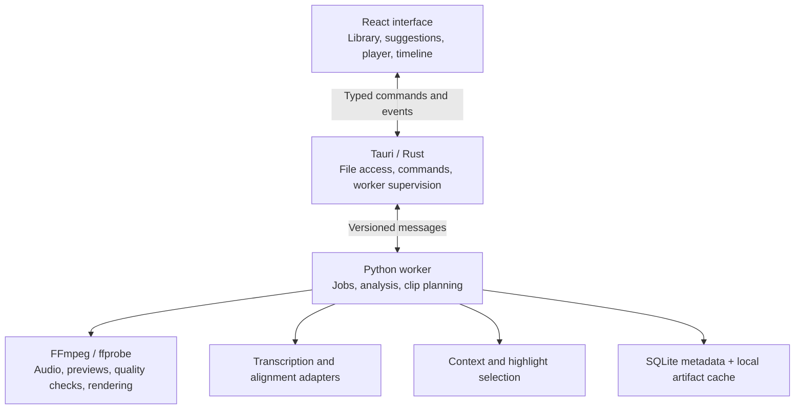

# SmartClipper: Initial Workflow, Architecture, and Milestones

Date: 2026-09-30
Status: Initial implementation plan
Related decision: [ADR 0001: Desktop stack](0001-desktop-stack.md)

## Product goal and initial scope

Build a Windows and macOS desktop app with this experience:

**Import a video -> receive 4-5 meaningful short suggestions -> preview and adjust them -> export ready-to-share videos.**

The first version focuses on spoken content: interviews, podcasts, tutorials, presentations, and talking-head videos. This makes it possible to evaluate whether clips preserve meaning. Sports, music, and largely silent videos need a different approach to highlight detection.

Use Tauri, React/TypeScript, Python, and FFmpeg. Generate editable clip plans before rendering final videos. Social account connections and direct publishing are deferred until the editing and export workflow is reliable.

## 1. User workflow

The user starts a project by dragging in a video or clicking **Import video**. Importing initially opens a local file; it does not require uploading the entire video to a server.

| Input | Purpose |
| --- | --- |
| Video file | Source material |
| Optional SRT, VTT, or TXT transcript | Reuse an existing transcript |
| Intended audience | Identify moments relevant to viewers |
| Desired style | Educational, story, interview, opinion, or demonstration |
| Preferred length | Start with a configurable 30-60 second default |
| Number of shorts | Default to 5 |

Audience and style are optional. The app can infer an initial interpretation and let the user correct it.

Show meaningful processing stages: **Reading video**, **Preparing transcript**, **Finding highlights**, and **Preparing previews**. Users can cancel, leave the project, and return later.

Each suggestion includes:

- Title, thumbnail, duration, and preview.
- Description of its topic.
- A selection reason, such as answering a common question or containing a complete before-and-after story.
- Anything needing attention, such as uncertain captions or poor framing.

Rank editorial quality and audience relevance. Do not present a speculative viral score as a promise; actual engagement requires audience feedback.

## 2. Desktop architecture



React handles interaction. Rust handles desktop integration and supervises the worker. Python coordinates processing. Native tools perform expensive media operations.

Communicate between the shell and worker using framed JSON messages on stdin/stdout. Send diagnostic logs to stderr. Transfer file references and metadata rather than full audio or video buffers.

Use SQLite for projects, jobs, transcript metadata, suggestions, and edit history. Store larger artifacts such as audio, thumbnails, proxies, models, and exports as files in an application-managed directory. The worker owns project writes to avoid competing desktop and worker database updates.

For cloud AI, send only material needed for the current step, with a clear user choice about cloud processing. Local transcription alone does not make the whole context-analysis pipeline offline.

## 3. Inspect the source and prepare reusable assets

Use ffprobe to inspect duration, dimensions, rotation, codecs, frame rate, variable timing, audio tracks, and stream start times.

Reject unreadable files with a useful explanation. Videos without audio can be imported, but the initial speech-based highlight pipeline should explain its limitation.

Prepare assets independently where resources allow:

| Artifact | Use |
| --- | --- |
| Analysis audio | Transcription and speech detection |
| Optional MP3 | Downloadable extracted audio |
| Thumbnail strip | Timeline navigation |
| Audio waveform | Speech and pause visibility |
| Preview proxy, when needed | Smooth playback of large or unsupported sources |

Use WAV for local speech analysis and MP3 as an export option. Do not require MP3 conversion before transcription.

```sh
# Analysis audio for a local Whisper pipeline
ffmpeg -i input.mp4 -map 0:a:0 -vn -ac 1 -ar 16000 -c:a pcm_s16le analysis.wav

# User-facing MP3 extraction
ffmpeg -i input.mp4 -map 0:a:0 -vn -c:a libmp3lame -q:a 2 audio.mp3
```

These commands illustrate the operations. Application code must also handle audio-track selection, errors, cancellation, and source-time offsets. See [FFmpeg documentation](https://ffmpeg.org/ffmpeg.html).

Attempt compatible source playback first; create a lower-resolution proxy when necessary. Do not automatically transcode every import. Final exports use the original source.

## 4. A shared transcript interface

Normalize every transcript source into one internal representation:

```text
Transcript
  language
  source: imported | local_asr | cloud_asr
  segments:
    id
    start_ms
    end_ms
    text
    optional speaker
    optional words with timestamps
    optional confidence
```

Do not invent confidence values when a provider does not supply them.

| Input | Processing |
| --- | --- |
| SRT / VTT | Parse timings, validate against video duration, check synchronization |
| TXT | Align text to audio; text alone does not identify cut locations |
| No transcript | Generate a transcript from audio |

An uploaded transcript may describe a different edit of the same video. Detect substantial mismatches and allow correcting the offset, replacing the file, or regenerating the transcript.

The initial local backend recommendation is **whisper.cpp behind a Python adapter**. It supports Windows and macOS, CPU execution, hardware acceleration including Metal on Apple Silicon, and voice activity detection. This provides native performance without writing a custom C++ inference engine. [whisper.cpp](https://github.com/ggml-org/whisper.cpp)

Benchmark **faster-whisper** as an alternative, especially on NVIDIA-equipped Windows machines. Its Python interface supports batching and word timestamps. Initially ship one validated default backend rather than several equally complex paths. [faster-whisper](https://github.com/SYSTRAN/faster-whisper)

For optional cloud transcription, the current OpenAI guidance recommends `gpt-transcribe` for ordinary recorded speech and `whisper-1` for word/segment timestamps. Select providers based on both recognition quality and timing requirements. Recheck model availability and API capabilities when implementing the adapter. [OpenAI transcription documentation](https://developers.openai.com/api/docs/guides/speech-to-text)

Treat precise word alignment as a separate capability. Evaluate WhisperX when subtitle timing or imported-text alignment needs improvement, considering language support and packaging cost. [WhisperX](https://github.com/m-bain/whisperX)

## 5. Context extraction and highlight selection

A useful short needs enough setup to make sense, an engaging central point, and a satisfactory ending. Selecting the most interesting sentence alone is insufficient.

1. **Create a topic map:** divide the transcript into coherent sections with original timestamps.
2. **Summarize the video:** record subject, intended audience, key arguments, terminology, and recurring themes.
3. **Generate candidates:** propose approximately 10-15 moments grounded in transcript segment IDs.
4. **Check surrounding context:** expand candidates that depend on an earlier question, unexplained reference, or missing conclusion.
5. **Rank candidates:** assess opening, standalone clarity, useful information, emotional interest, and audience relevance.
6. **Remove repetition:** select 4-5 distinct moments rather than variants of the same point.
7. **Validate timing in code:** resolve segment IDs to actual timestamps; check duration, boundaries, and source limits.

AI proposes which source segments belong together. It must not invent timestamps or quotes.

Favor one continuous excerpt per short in the first version. Stitching distant statements into a new sequence increases editing complexity and the risk of changing meaning.

```text
ClipPlan
  source_video_id
  transcript_revision
  selected_segment_ids
  source_ranges
  title
  selection_reason
  quality_findings
  crop_settings
  caption_settings
  revision
```

Use cost-efficient models for extraction and preliminary classification, with stronger models for final selection when evaluation demonstrates a benefit. Development Luna/Sol/Astra profiles are separate from runtime model configuration.

## 6. Visual context and quality filtering

Transcript analysis can miss a demonstration, slide, reaction, or visual reveal. Add visual evidence selectively.

Detect shot boundaries and extract representative frames. PySceneDetect's adaptive detector adjusts to surrounding frame changes and can reduce false detections caused by camera motion. [PySceneDetect](https://www.scenedetect.com/docs/latest/api/detectors.html)

Run lightweight checks across the source, then analyze shortlisted ranges in more detail:

| Finding | Initial response |
| --- | --- |
| Undecodable or corrupt footage | Exclude affected ranges |
| Sustained black frames | Flag or exclude, considering intentional transitions |
| Severe blur | Reject the candidate or adjust boundaries |
| Brief motion blur | Evaluate in context |
| Face not detected | Do not automatically reject; slides and demonstrations may be valuable |

FFmpeg provides `blackdetect` and `blurdetect`. Calibrate thresholds against representative footage. Sampled scans can miss brief defects, so inspect selected ranges more densely before export. [FFmpeg filters](https://ffmpeg.org/ffmpeg-filters.html)

Removing a defective interval from the middle of an explanation may break the sentence. Prefer another candidate or flag it for review. Produce fewer than five clips when the source cannot support five good ones.

## 7. Preview and timeline workspace

```text
+--------------------------------------------------------------+
| Project name     Analysis status              Export selected |
+----------------+--------------------------+------------------+
| Suggested      |                          | Transcript       |
| shorts         |      Video preview       |                  |
|                |                          | Click text to    |
| Title          |  Original / Final crop   | seek the video   |
| Duration       |                          |                  |
| Why selected   |                          | Caption settings |
+----------------+--------------------------+------------------+
| Timeline: thumbnails, waveform, clip ranges, quality markers  |
| Play / Pause    Zoom    Trim handles    Undo / Redo             |
+--------------------------------------------------------------+
```

Selecting a suggestion jumps to its range. Clicking transcript text seeks to that point. Trim handles snap to nearby speech boundaries with an option for precise adjustment.

Provide two timeline views:

- **Source overview:** where all suggestions occur in the original video.
- **Selected short:** that short's edits, captions, and crop settings.

Keep editing nondestructive: changes update the clip plan and leave the source intact.

Review uses source/proxy playback over the selected ranges. Generate a small preview render only when an effect cannot be accurately represented in the player. Moving a trim handle should not repeatedly encode video.

## 8. Export approved clips

Initial export capabilities:

- Vertical 9:16 output.
- Manual crop with safe framing controls.
- Optional readable captions.
- MP4 output with compatible video/audio settings.
- Optional SRT captions and extracted MP3.
- Batch export of selected suggestions.

Start with manual cropping and a fit-within-vertical-frame alternative. Add subject tracking after the basic workflow works; a centered crop can lose speakers, slides, or products.

Translate clip plans into FFmpeg operations for trim, crop, scale, captions, and audio processing. Accurate arbitrary cuts and visual effects generally require re-encoding. Stream copying is useful only for compatible cases.

Maintain a source-time to edited-time mapping so captions remain synchronized after cuts. Preserve media timing internally, especially for variable-frame-rate sources.

## 9. Codebase responsibilities

Paths below are planned implementation modules, not existing application code. Engine paths are relative to `packages/media-engine/src/smartclipper_engine/`.

| Area | Planned responsibilities |
| --- | --- |
| `apps/desktop/src/features/library` | Import, project list, processing status |
| `apps/desktop/src/features/editor` | Suggestions, player, transcript, timeline, crop controls |
| `apps/desktop/src/features/exports` | Presets, export queue, results |
| `apps/desktop/src-tauri/src` | Validated commands, worker supervision, file access |
| Engine `domain/` | Video, transcript, time range, quality finding, clip plan |
| Engine `pipeline/` | Import, transcription, analysis, selection, rendering jobs |
| Engine `adapters/media/` | ffprobe, FFmpeg, scene analysis |
| Engine `adapters/transcription/` | Subtitles, local ASR, alignment, optional cloud |
| Engine `adapters/ai/` | Context extraction and ranking |
| Engine `ipc/` | Commands, progress, cancellation, errors |
| `packages/contracts` | Shared schemas and representative messages |

Add persistence and artifact-cache modules within the media engine. Persist each job as `queued`, `running`, `completed`, `failed`, or `cancelled`. Reuse successful intermediate outputs so an export failure does not trigger another transcription.

## 10. Sequential implementation milestones

| Milestone | Deliverable | Completion criterion |
| --- | --- | --- |
| **1: First working desktop slice** | Launch, import MP4, playback, choose a range, export one clip | Works on Windows/macOS; source unchanged; exported audio/video synchronized |
| **2: Audio and transcripts** | WAV preparation, MP3 export, SRT/VTT import, local transcription, transcript seeking | Segment clicks seek correctly; missing audio and invalid subtitles handled |
| **3: Context-based suggestions** | Topic map, candidate generation, ranking, 4-5 suggestions | Real source segments, complete ideas, limited duplication |
| **4: Visual context and quality** | Shot boundaries, representative frames, quality intervals | Fixture defects detected; valid slides/dark scenes not indiscriminately rejected |
| **5: Review workspace** | Cards, source/clip timelines, trims, transcript edits, undo/redo | Review and adjustments do not rerun unrelated analysis |
| **6: Publishable exports** | Vertical framing, captions, batch rendering, preview consistency | Export framing, timing, captions, and duration match approved plans |
| **7: Speed and reliability** | Caching, bounded concurrency, cancellation, restart recovery | Reopen reuses valid artifacts; failures preserve edits |
| **8: Installable beta** | Packaged workers, model downloads, Windows installer, signed/notarized macOS distribution | Clean machines need no separate Python or FFmpeg installation |
| **9: Social publishing, later** | Account connections and publishing adapters | Platform authorization, upload, and retries validated |

Milestone 1 includes an early packaging experiment on both operating systems. Discover playback and sidecar-distribution problems before building the full AI workflow.

The UI and media-engine branches can work concurrently after contracts are agreed. The AI branch initially consumes saved transcript fixtures so suggestion quality can improve before desktop integration is complete. Follow [the team workflow](../development/team-workflow.md) for focused branches and pull requests.

## 11. Performance and quality evaluation

Optimize time to first useful suggestion, time spent reviewing, and time to final export.

Measure:

- Transcription time divided by source duration.
- Time to first candidate preview.
- Export time for a fixed clip and preset.
- Peak memory and temporary disk usage.
- Cache-hit rate and cloud cost per source minute.

Benchmark a defined Windows CPU laptop, Windows NVIDIA machine, and Apple Silicon Mac. Establish processing-time targets from measured results rather than promising universal speed.

Cache by source fingerprint, stage settings, and model/version. Caption edits invalidate captions and affected exports, not transcription. Changing the audience reruns selection, not audio extraction.

Bound heavy-job concurrency, especially when transcription and encoding compete for a GPU. Generate thumbnails and waveform data at useful resolutions, keep models loaded across related jobs, and inspect shortlisted footage more deeply than the rest.

Create a small, consented evaluation set with interviews, tutorials, accents, noise, silence, screen recordings, rotated footage, and variable-frame-rate recordings. Reviewers label useful moments and judge whether suggestions are understandable, faithful, distinct, and worth publishing.

## First implementation target

Start with Milestone 1: one local video, a working player and basic timeline, a manually selected range, and a correct export on both platforms. This establishes playback, timing, worker communication, and rendering foundations for the later AI features.
