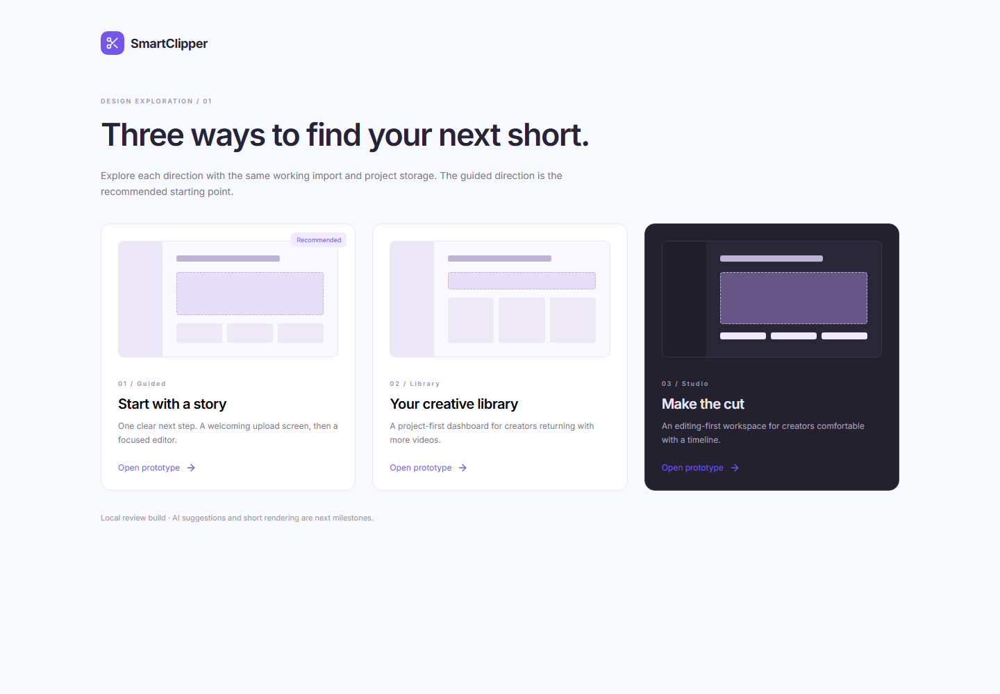
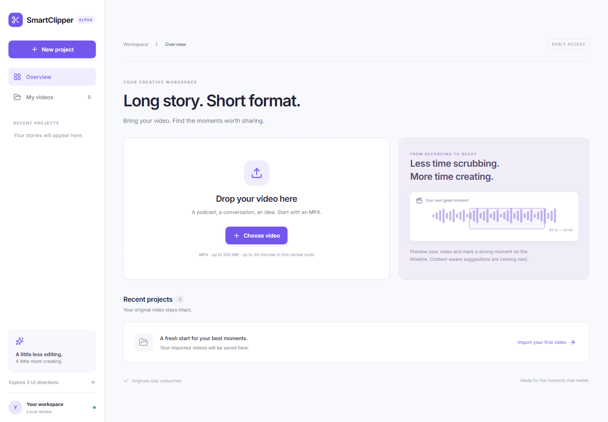
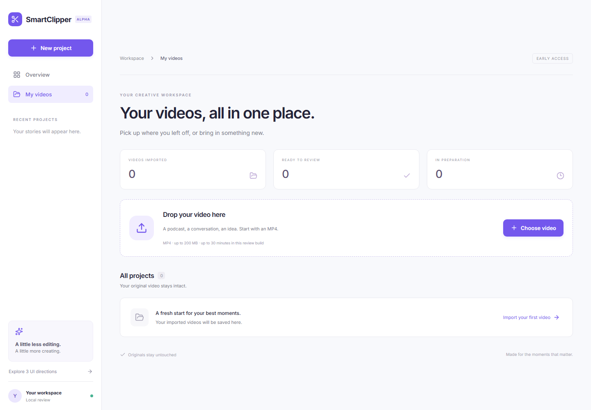
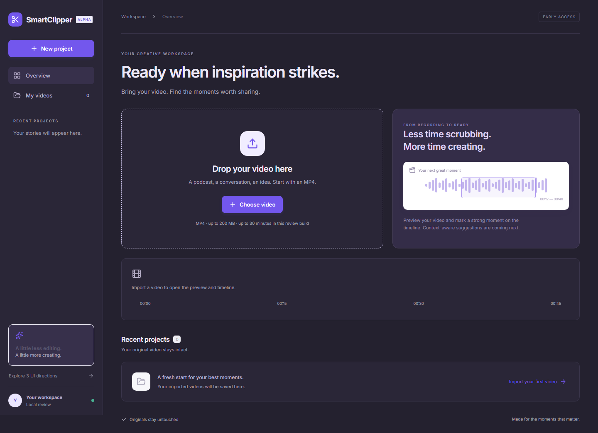
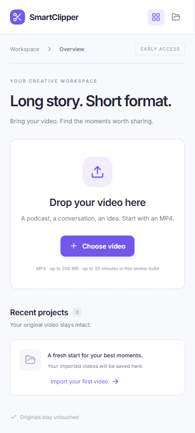

# SmartClipper UI review

Date: 2026-10-01.

## Three directions

Open http://127.0.0.1:5173/?review while the local app is running.

| Direction | Review URL | Intent |
| --- | --- | --- |
| 01 Guided — selected | /?design=guided | One obvious upload action, then focused playback and timeline selection |
| 02 Library | /?design=library | Project-first dashboard with real imported/ready/preparing counts and search |
| 03 Studio | /?design=studio | Dark editing workspace with an immediate timeline entry point |

The guided direction is the default because a new user can start without understanding an editor. Imported projects open the video workspace with start/end controls, saved selection, and MP3 download. Each prototype uses the same working API and database. Empty states contain no fabricated generated shorts.

### Guided

### Library

### Studio

### Mobile guided layout

Screenshots use deterministic empty project data. Real video playback and persistence are checked separately. The waveform illustration is a decorative example, not analysis of an imported video.

## Figma status

The connected account successfully created [SmartClipper Web UI Review](https://www.figma.com/design/ywRZyWbXO2ZunP3U3eYrSr).

Both editable design writing and page capture were rejected by the Figma integration with: “MCP tool call requires approval, but approval policy is never.” The review file is blank; these three options have not been transferred to Figma. Their working browser prototypes and screenshots are committed here. Completing the editable Figma deliverable requires the session's Figma write/capture approval capability to be enabled.

## Validation evidence

- 27 Python API/worker unit and native media tests pass, including corrupt content, streaming/size limits, no-audio video, byte-range playback, and MP3.
- 9 frontend tests cover empty upload state, invalid files, imports, saved selections, and the three review directions.
- Playwright checks the responsive review flow and upload-to-project navigation.
- Two 12-second FLOSS Weekly excerpts passed actual HTTP upload, FFmpeg preparation, preview range requests, and MP3 download.
- A real browser loaded the prepared video, saved a 2-8 second range, reloaded, and retrieved the persisted range without page errors.

The podcast excerpts and editor screenshot remain ignored local artifacts. This checks import/playback; it does not establish transcription/highlight quality or full-length upload performance.

## Review prompts

Evaluate the guided import screen, navigation, video preview, selection controls, mobile layout, and project statuses. AI suggestions, captions, crop, and rendered shorts are future features and clearly labeled in the current UI.
