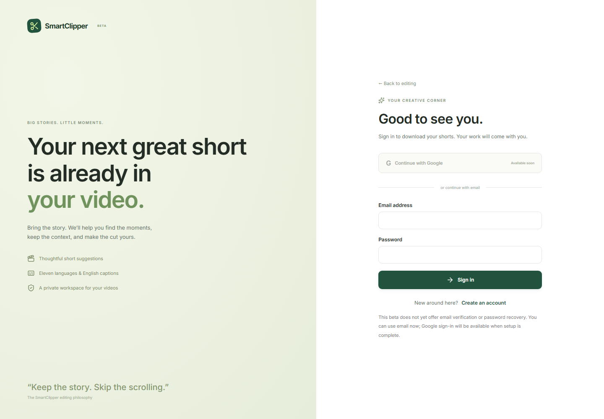
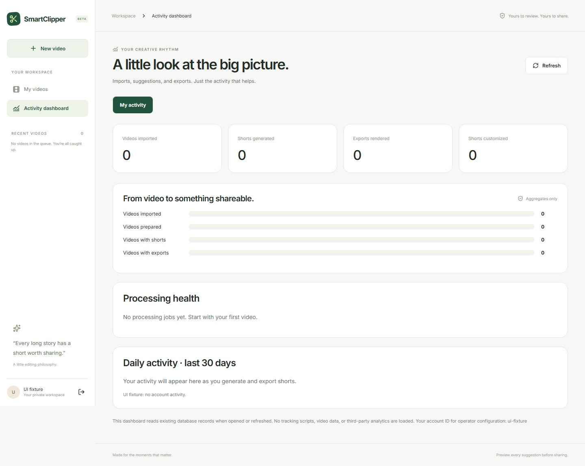

# Guided SmartClipper UI

Date: 2026-10-01. The owner selected direction 01. Alternate library/studio designs and the direction switcher have been removed from the app and capture tooling.

## Pages

- **Sign in / signup:** email account creation and Google sign-in when configured, requested at download rather than first entry. Facebook is hidden for now. Editorial quotes are attributed to the product philosophy, not invented users.
- **My videos:** one import action, a language/platform/length panel, accurate benefits and the real project library.
- **Source workspace:** a larger video preview and timeline, MP3 extraction, timed transcript upload and generation preferences. The old context-coming promotion panel is removed.
- **Your shorts:** a dedicated page with clip selection, a large vertical player, three context sentences and the actual excerpt transcript. Subtitles, language, music, title and cover changes stay in one focused customization panel.
- **Cover editor:** three quality-checked choices when available, styled text, custom image upload and video-frame capture. Covers download separately as JPG.
- **Activity dashboard:** personal or authorized operator aggregates, with a simple funnel and daily requests. Loads only when opened/refreshed.

Documentation screenshots use labeled deterministic UI fixtures. Actual generated video acceptance is recorded separately in ignored local smoke evidence. No synthetic example is presented as a customer testimonial or a measured virality score.

## Validation boundary

Unit tests cover preferences, upload navigation, account creation, captions, revisions, thumbnails, ownership, job snapshots and dashboard permission checks. Browser journeys cover desktop/mobile overflow, import, results, cover navigation and personal activity. Native integration checks the generated vertical MP4, covers and caption/music export. Real English podcast recognition/generation is tested locally; eleven-language strings are preserved in unit tests, while multilingual accuracy/glyph acceptance remains future work.

## Historical Figma status

The earlier [Figma review file](https://www.figma.com/design/ywRZyWbXO2ZunP3U3eYrSr) is blank: the integration rejected design writing/capture because its approval requirement was incompatible with the session policy. No editable Figma frames are claimed. The current guided implementation is reviewable in the browser and repository screenshots.
